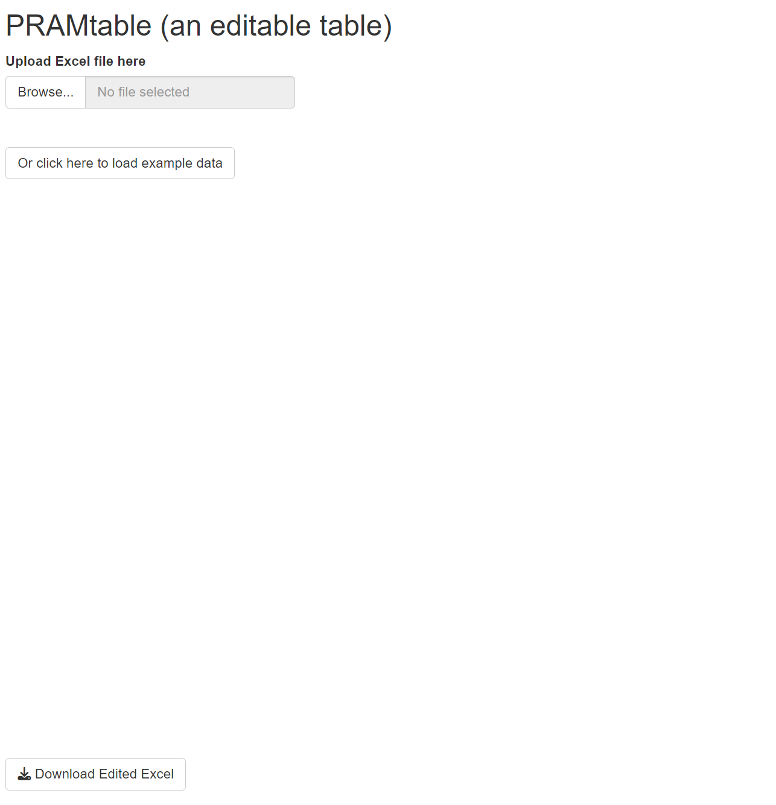
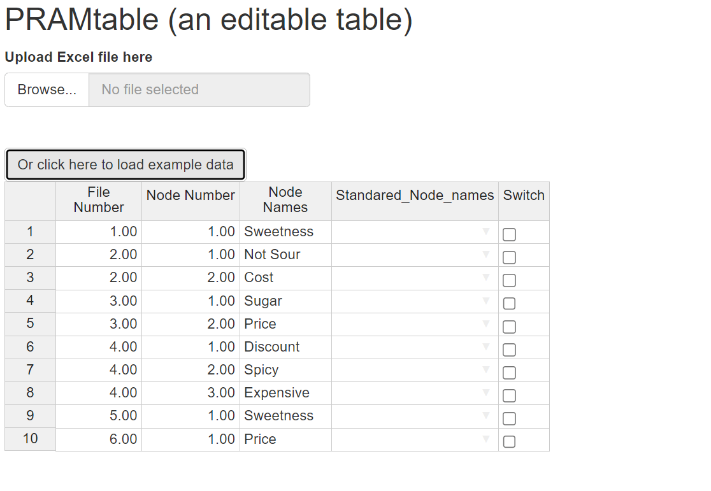
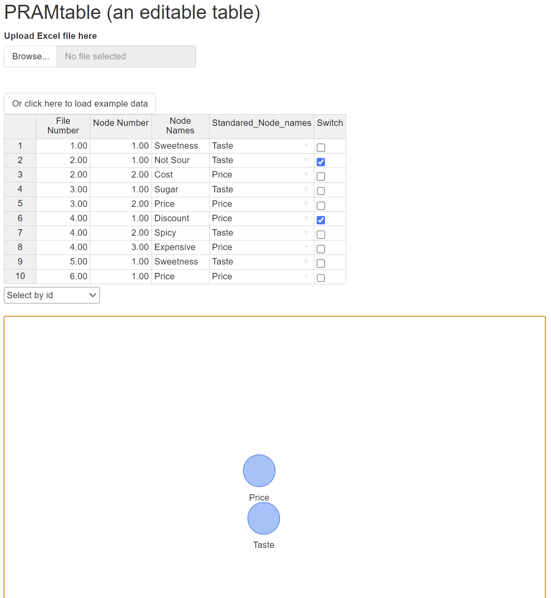

# PRAM.Analysis.Project.EA

The goal of PRAM.Analysis.Project.EA is to be used alongside CIETmap to improve an existing network analysis workflow. It will form the base of an update to CIETmap in the future. It is a Shiny app that aids with the standardization and categorization process.

to learn more about Fuzzy cognitive map analysis please read:

**Four analysis moments for fuzzy cognitive mapping in participatory research** *Journal of Public Health Research* DOI: [10.1080/16549716.2024.2430024](https://www.tandfonline.com/doi/full/10.1080/16549716.2024.2430024?src=#abstract)

## Installation

You can install PRAM.Analysis.Project.EA from [GitHub](https://github.com/) with:

``` r
# Install devtools if not already installed
install.packages("devtools")

# Install PRAMAnalysis from GitHub
devtools::install_github("Programming-The-Next-Step-2025/PRAM-Analysis-Project-EA")
```

## Usage

After installing the package you can begin using it to launch the Shiny app:

```{r}
library(PRAMAnalysis)
#launch the Shiny app 
run_app()
```

### Start up

This is what the user interface(UI) will look like on start up:



From here you can click the button to browse your computor for any Excel file using the first button.

### Behind the Scenes (Data Parsing)

### `parse_uploaded_file()`

This function handles Excel file uploads in the Shiny app.

**Purpose**: It checks the uploaded file’s format and reads it into R as a data frame,

**How it works**:

-   Uses `shiny::req()` to ensure a file is provided.

-   Validates that the file has an Excel-compatible extension (`.xls` or `.xlsx`).

-   Reads the Excel file using `readxl::read_excel()`.

-   Returns the parsed data as a `data.frame` for use in the app.

-   if a user uploads a file that isn't supported it will return an error

### `prepare_shiny_data()`

Once the data is uploaded, this function formats it for use in the app’s interface.

**Purpose**: It subsets the first three columns of the uploaded data (assumed to be static) and adds new columns to facilitate labeling and toggling in the UI.

**How it works**:

-   Extracts the first three columns (e.g., ID, concept, weight)

    Adds:

    -   Standared_Node_names\`: a blank text column for standardized naming(based on the output of CIETmap.

    -   `Switch`: a Boolean column for toggling edge weight direction (+/-).

# Editing the Table

You can use the example to preview what the table will look like



As you can see the table had 2 columns where you can add the names and switch the edges.

Once you've given each Node a new Label you'll see a visualization of how many unique standard names you've made!


